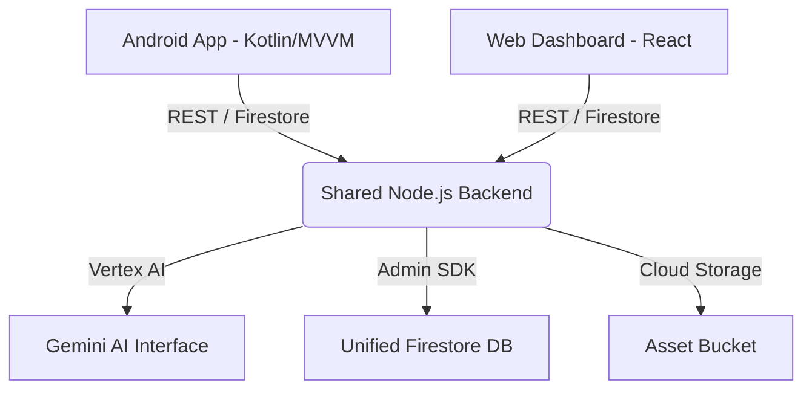

# Riwayat: The AI-Powered Digital Co-Pilot for Artisans 🎨🚀

[](https://kotlinlang.org/)
[](https://firebase.google.com/)
[](https://deepmind.google/technologies/gemini/)
[](https://nodejs.org/)
[](LICENSE)

**Riwayat** is a mission-critical digital ecosystem designed to empower local artisans by bridging the digital divide through Generative AI. It transforms complex business workflows into an intuitive assistant, enabling artisans to digitize inventory, automate marketing, and manage global sales with a voice-first, AI-native interface.

---

## 📖 Table of Contents
- [Vision & Mission](#-vision--mission)
- [The 5 Pillars of Riwayat](#-the-5-pillars-of-riwayat)
- [Advanced AI Capabilities (V2.0)](#-advanced-ai-capabilities-v20)
- [System Architecture](#-system-architecture)
- [Technical Stack](#-technical-stack)
- [Setup & Installation](#-setup--installation)
- [Database Schema](#-database-schema)
- [Future Roadmap](#-future-roadmap)

---

## 👁️ Vision & Mission
Artisans are the custodians of culture, but they often struggle with the digital divide. **Riwayat** (meaning 'Tradition' or 'Legacy') acts as a digital brain, automating the "boring" parts of business (accounting, marketing, SEO) so artisans can focus on their craft.

---

## 🌟 The 5 Pillars of Riwayat

1.  **🏠 Home (Command Center)**: A real-time executive dashboard providing earnings overview and AI-driven "Actionable Alerts" for stock replenishment or order deadlines.
2.  **🎨 Create (AI Studio)**: A powerhouse for branding. Uses **Gemini Vision** to generate professional marketing kits, asset descriptions, and high-conversion social media content.
3.  **🛒 Shop (Omni-Channel)**: Automated inventory management. Features direct integration logic for ONDC and Instagram, allowing artisans to list products globally in seconds.
4.  **📊 Operations (Back-Office)**: Intelligent ledger management. Includes **Predictive Analytics** for seasonal trends and simplified tax summaries for GST compliance.
5.  **🌱 Grow (Collaborative Hub)**: A dedicated space for growth. Features a **B2B Material Marketplace** for sourcing raw materials and AI-guided learning modules.

---

## 🚀 Advanced AI Capabilities (V2.0)

### 🖼️ Multi-Modal Visual Studio
- **AI Vision Analysis**: Powered by `gemini-1.5-flash`, the app analyzes raw product photos to extract material, craft type, and color palettes.
- **Background Removal & Ad Creation**: Automatically creates studio-quality product cards for social media.
- **AR Lite Preview**: Placeholder for ARCore integration, allowing buyers to visualize products in 3D.

### 🎙️ Voice-First Business Logic
- **Natural Language Parsing**: Uses a centralized Node.js backend to parse artisan voice commands into structured business actions (e.g., *"Sold 2 silk scarves for 500 each"* -> SALE: 1000).
- **Hands-Free Inventory**: Voice-guided product entry to eliminate manual typing obstacles.

### 📈 Predictive Intelligence
- **Sales Forecasting**: AI analyzes historical ledger entries to provide a 30-day sales outlook and actionable business tips.

---

## 🏗️ System Architecture
Riwayat follows a modern **Multi-Tier Microservice Architecture** to ensure cross-platform consistency and scalability.



---

## 🛠️ Technical Stack

-   **Mobile**: Native Kotlin, Android Jetpack (ViewModel, LiveData, Navigation, Hilt), ViewBinding.
-   **Web**: React.js, Tailwind CSS (optional-ready), Material UI.
-   **Backend**: Node.js, Express, Firebase Admin SDK.
-   **AI**: Google Gemini (Vertex AI for Firebase), Gemini Vision, Speech-to-Text.
-   **Database**: Google Cloud Firestore (Real-time NoSQL).

---

## ⚙️ Setup & Installation

### 1. Database Initialization
```bash
cd content_creation/server
node setup_firestore.js # Initializes unified collections & dummy data
```

### 2. Node.js Backend
```bash
cd content_creation/server
# Update GEMINI_API_KEY in server.js
node server.js
```

### 3. Android Application
1. Open the `/Android` folder in **Android Studio**.
2. Place your `google-services.json` in the `app/` directory.
3. Enabled the **Vertex AI for Firebase API** in your Google Cloud Console.
4. Sync Gradle and build the APK.

### 4. Web Marketing Dashboard
```bash
cd content_creation/brand-ai-app/frontend
npm install
npm start
```

---

## � Database Schema
The project uses a unified schema documented in [SCHEMA.md](./content_creation/server/SCHEMA.md).
- `users/`: Artisan profiles & brand personas.
- `inventory/`: Real-time stock across all platforms.
- `marketing/`: AI-generated ad creatives and social media kits.
- `ledger/`: Financial transactions parsed from voice/manual entry.

---

## 🗺️ Future Roadmap
- [ ] Integration with Shiprocket for smart shipping labels.
- [ ] WhatsApp Bot sync for order management via chat.
- [ ] Full ARCore integration for virtual try-on models.
- [ ] Multi-lingual support (Hindi, Bengali, Urdu) for voice commands.

---
*Empowering tradition through technology. Built for the artisans of tomorrow.* ✨
